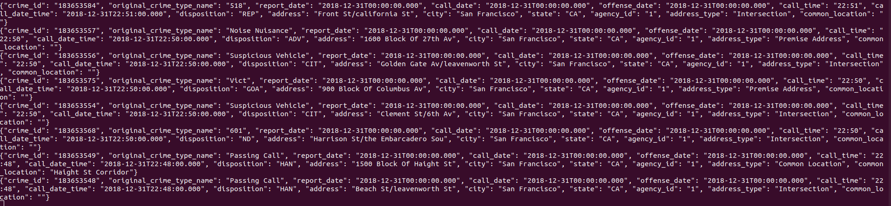
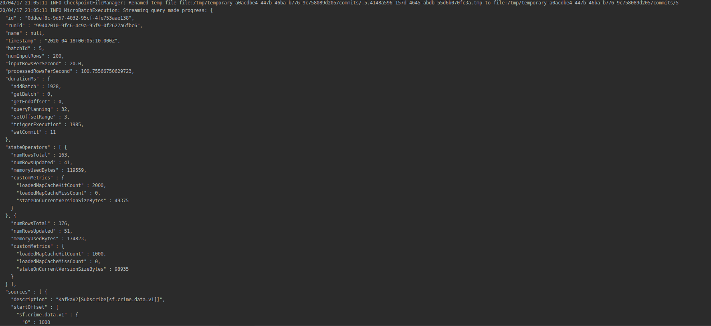
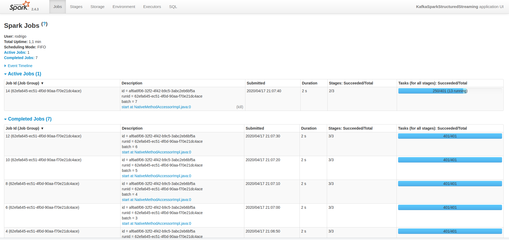

**How did changing values on the SparkSession property parameters affect the throughput and latency of the data?**

The only parameter working in standalone mode is the "master" and "spark.default.parallelism" parameters.
The number inside brackets in the "master" parameter indicate the number of threads used by the workers.

**What were the 2-3 most efficient SparkSession property key/value pairs? Through testing multiple variations on values, how can you tell these were the most optimal?**

It's difficult to measure the variations of results with this small size of dataset (i've produced around 200k messages in kafka topic). But, in standalone, the two main 
parameters was the "master(local[8]", which means 8 threads, and the "spark.default.parallelism=2".

I've tried changes in parameters spark.executor.cores, spark.executor.memory and spark.cores.max but with no changes in metrics values. 

Screenshots

